# ESP32 based iot switch
An IOT switch designed in KiCad based on ESP32-C5 and GDEY037T03 e-paper display. All electronic components were sourced from AliExpress (wanted to try something I guess).
## ESP32-C5
32-bit single-core RISC-V MCU running at up to 240 MHz with 29 GPIOs.

- Dual-band 2.4/5 GHz connectivity
- Wi-Fi 6
- BLE 5
- Zigbee and Thread support

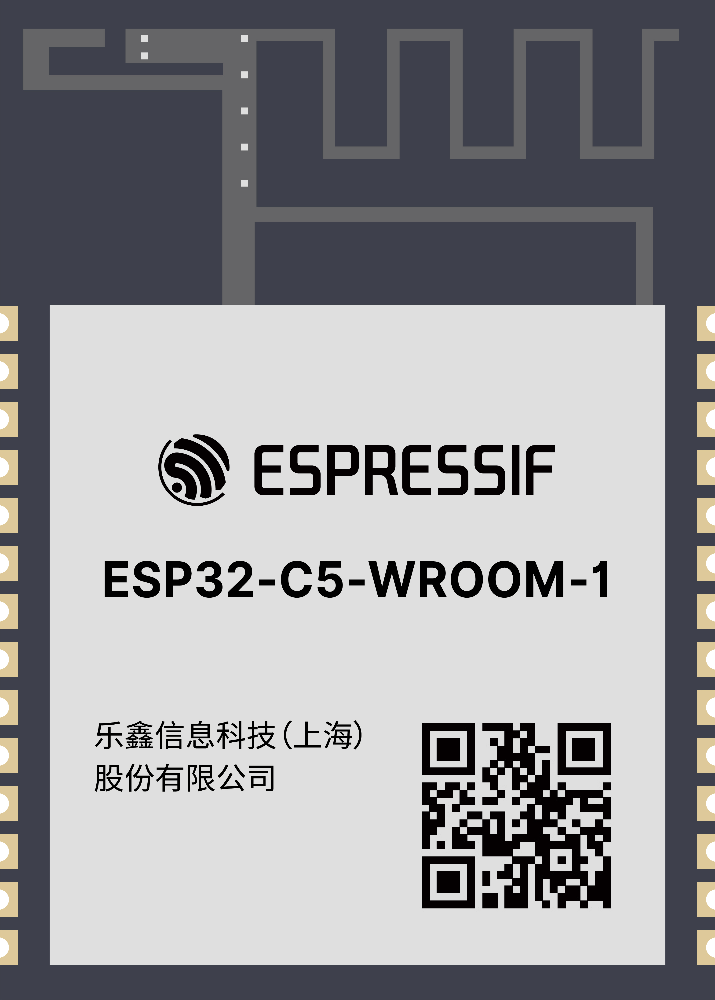

## GooDisplay GDEY037T03
3.7" black-and-white e-paper display.
- 240x416 resolution.
- 4-wire SPI interface

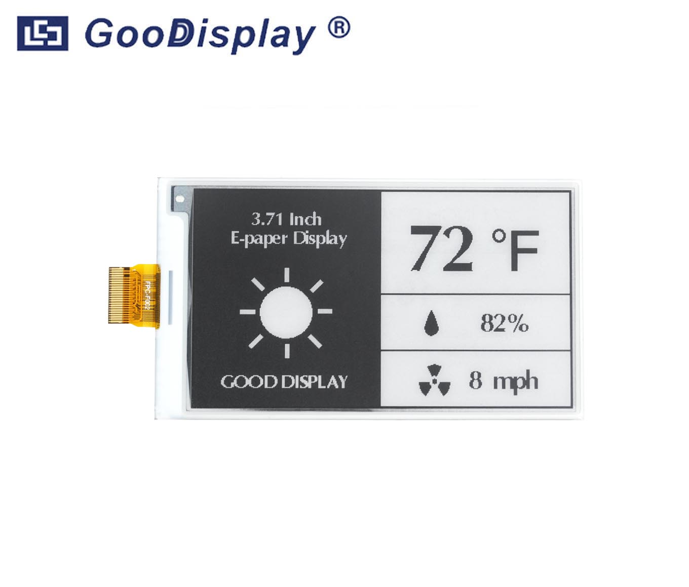
## 1. Part sourcing and Power Budget
All components used in this project were sourced from AliExpress.

A simple system block diagram was created early in the design process to estimate the power budget and guide component selection.

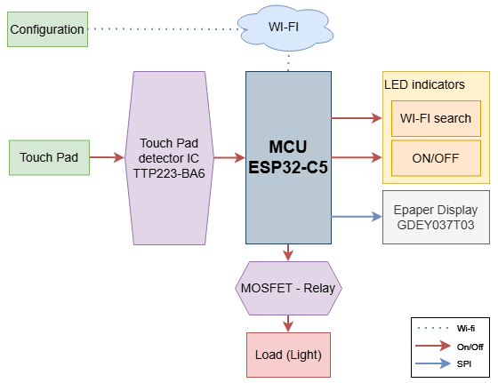

The BOM was progressively refined while developing the schematic.
## 2. Schematic and PCB layout
The schematic was designed using reference circuits from datasheets, application notes, and technical articles.

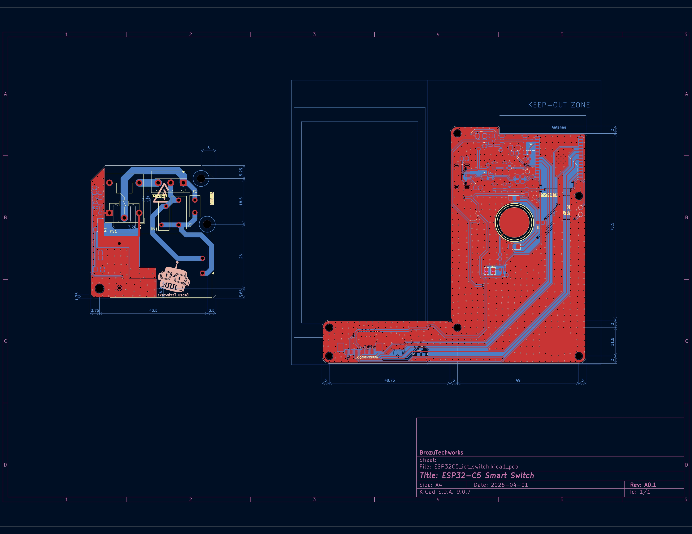

The PCB layout show some of the mechanical constraints of the enclosure.

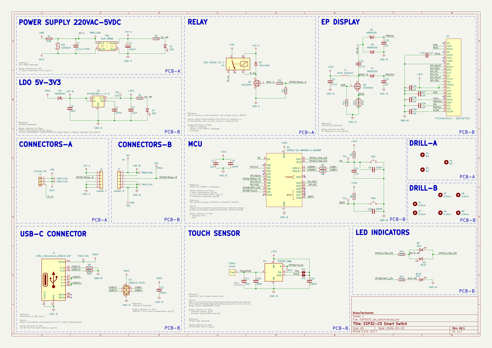

|  |  |
|-----------|-----------|
| 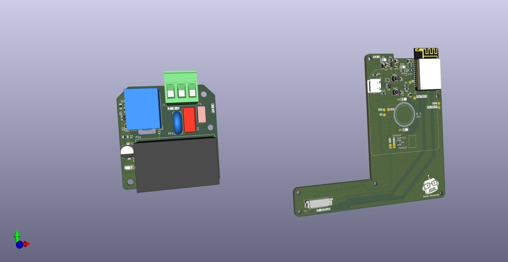 | 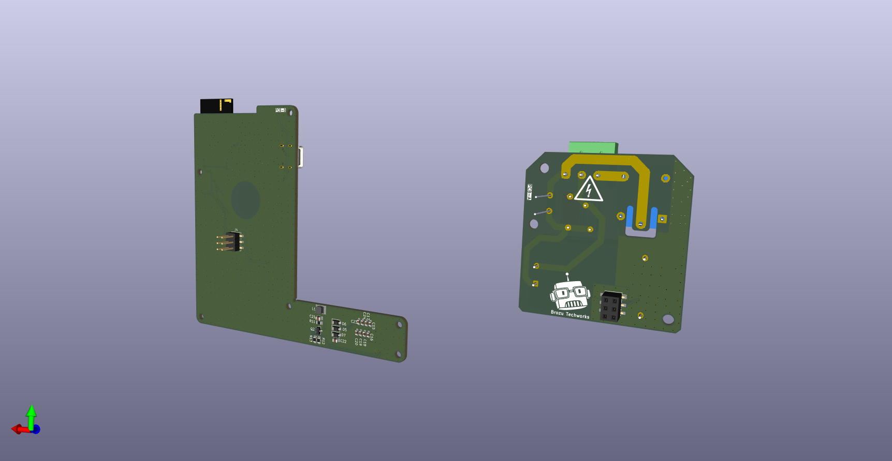 |
## 3. PCB Assembly
All components were manually assembled and soldered with a soldering iron (yeah...). 

PCB-A
|  |  |
|-----------|-----------|
| 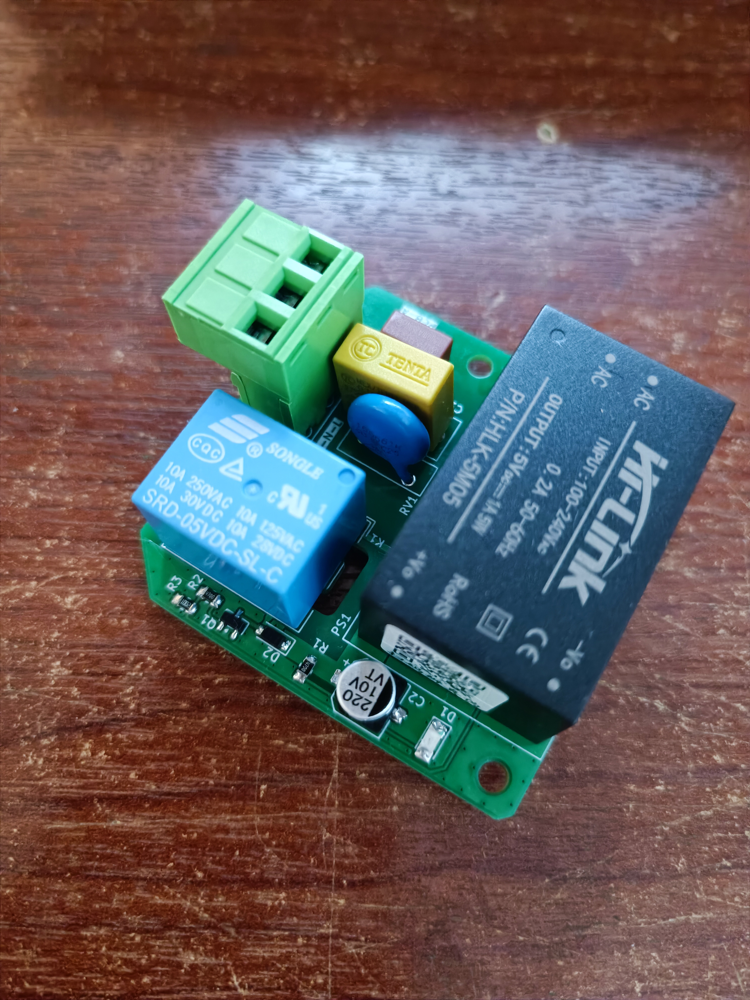 | 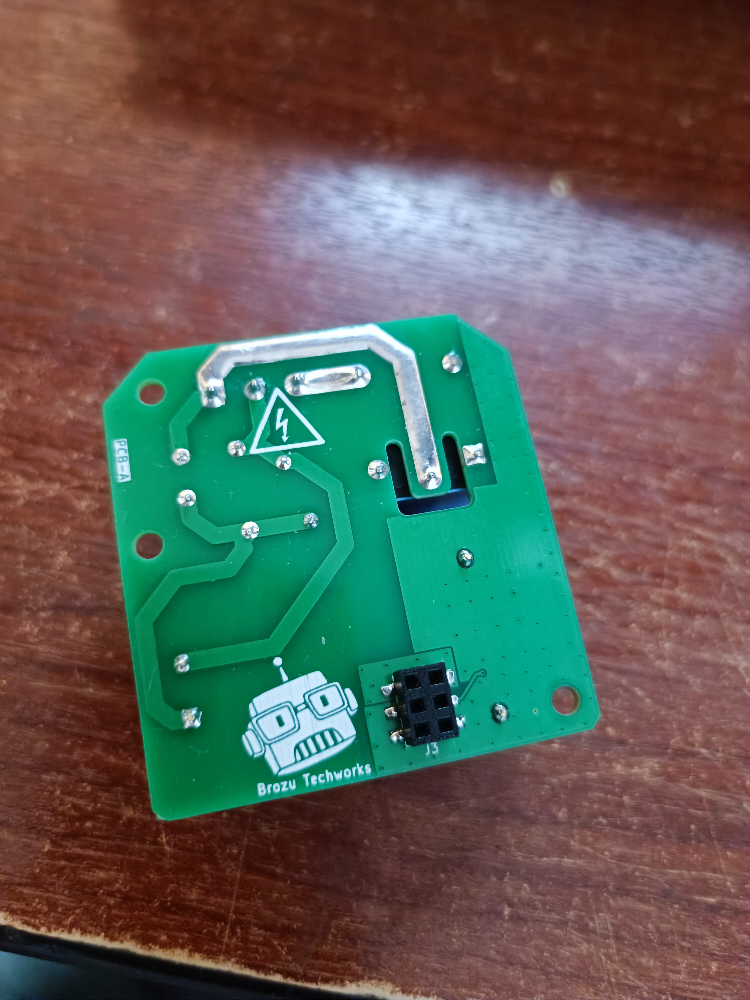 |

PCB-B
|  |  |
|-----------|-----------|
| 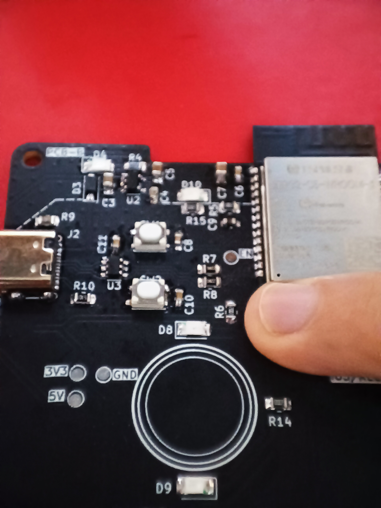 | 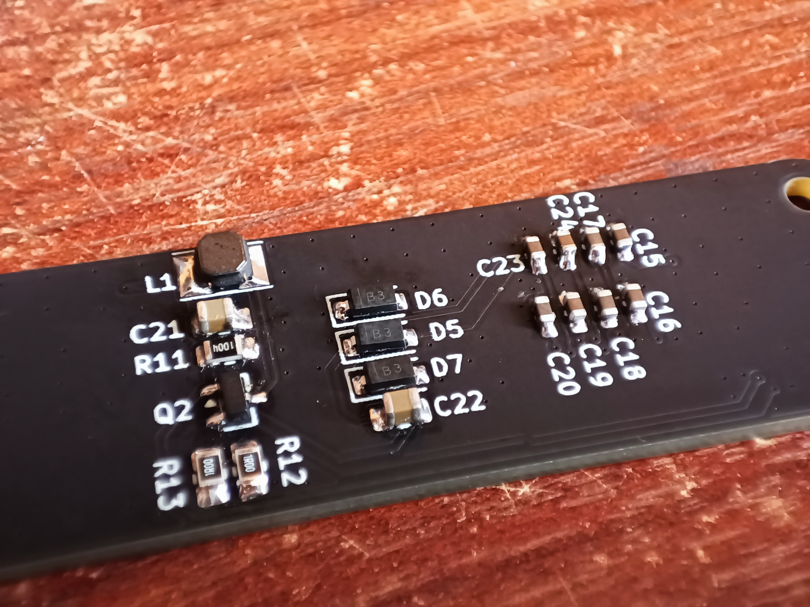 |
## 4. Firmware...
Firmware development is still in progress.

Current work focuses on developing an integration library between the GDEY037T03 e-paper display and the Adafruit GFX library.

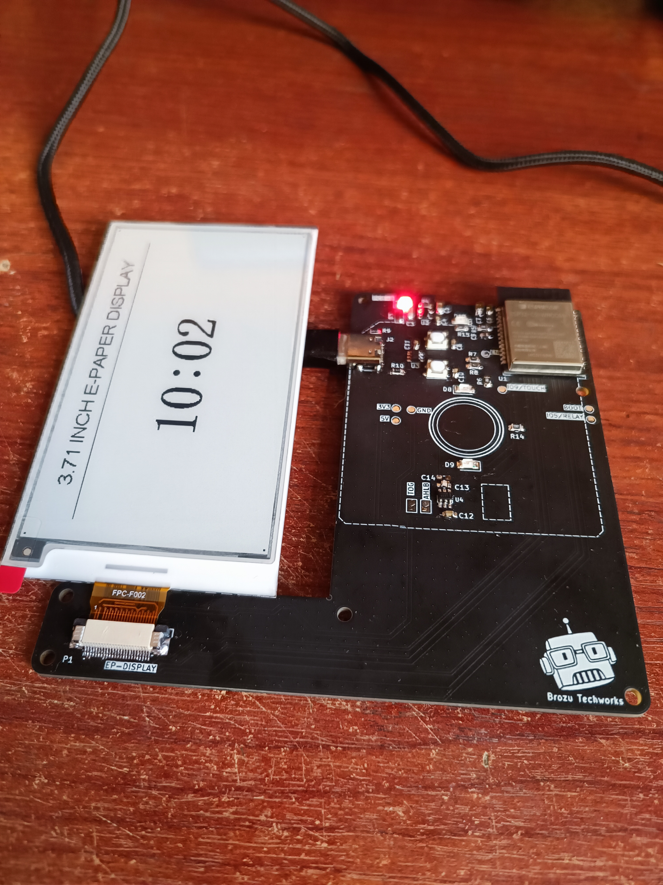